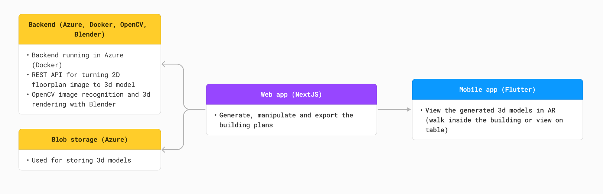
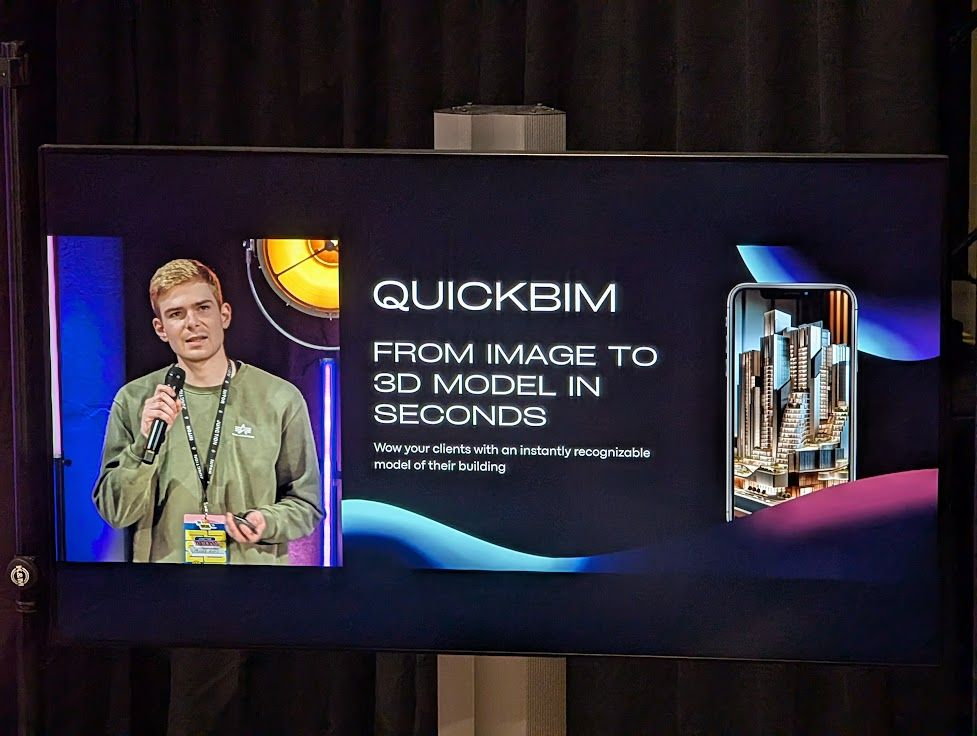
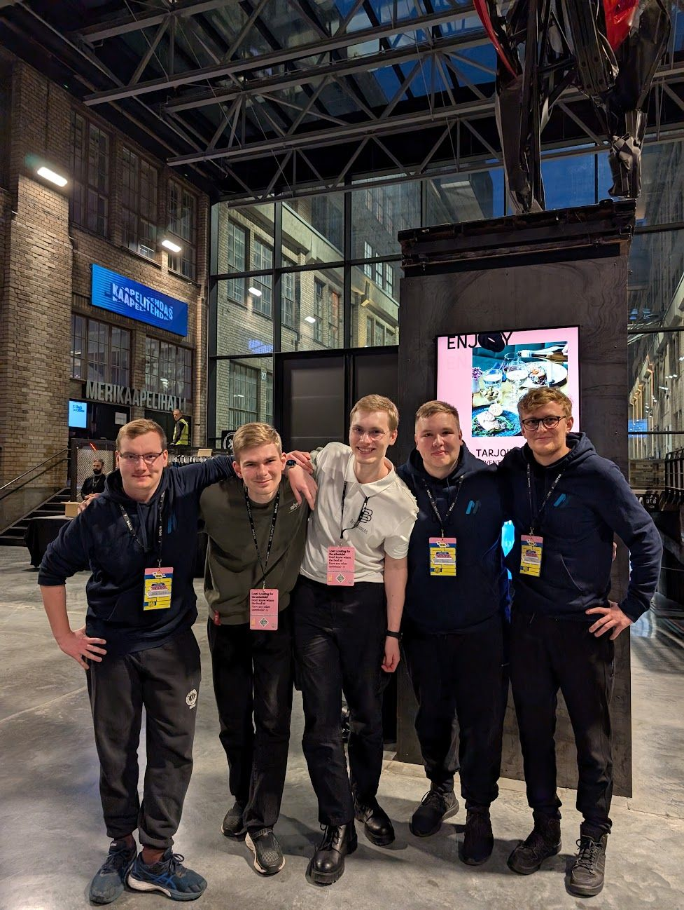

A weekend full of pure brainstorming, development, troubleshooting and some more troubleshooting. Free food, workshops and cool challenges all provided for you. What more could you ask for?!

## What is Junction?
Junction is one of the biggest Hackathons in Europe. It's hosted in Helsinki with over 1500 attending every year. From all over the world! You can read more about Junction here: https://www.hackjunction.com

## Familiar faces, new challenges
The amazing thing about these events is that no matter the skill level, you can get something awesome done with friends or alone. It was our friend groups 3rd consecutive year attending Junction and we brought a new member this time around. It was Lauri's first time at a bigger event like this, so we had the unique opportunity to show him the ropes and how we like to operate. We were also able to motivate another group to join from our university and they had a blast.

### AAAAA! What should we do?
Picking the challenge is arguably the most stressful part of the hackathon. And you have to do that right at the beginning! Choosing an interesting track that not only suits your skills, but offers you something new to learn can be challenging. And it was. 

We ended up doing KONE's challenge called "BIM for any building, by anyone". The challenge was to generate 3D models from given floorplan SVG's. And then be able to place a KONE elevator in that building.

The challenge allowed us to dive deeper into 3D rendering and handling in a web development environment. Which was all quite new to most of us.

## Gameplan
Me having the most experience in 3D modeling and rendering, I started researching ready made solutions or projects for our SVG -> 3D process. After a few hours of digging we ended up finding a functional and dockerized project that we could use as our base. It utilized some smart math and Blender under the hood to draw found lines from the SVG. And a trained OpenCV model to recognize walls, windows and doors from the SVGs.

Now that the tool from SVG -> 3D model had been found I could focus on getting it running in Azure and make sure we could access it. And oh boy was that easier said than done. After hours and hours of rebuilding Docker images, changing configurations and touching up code where needed we finally got it up and running. Now we could use a basic API to upload an image, build the 3D model and then save it to an Azure blob storage.

While I was struggling with Azure and Docker containers, the rest of the team built the Web app for rendering the models, arranging floors and uploading images. Additionally we made a Flutter app that you could use to render the 3D models in AR.

## Sauna break
On Sunday after getting the project to a "near ready" state, we decided to take a break with the rooftop sauna. And wow was the view nice. Sauna was great and we had the opportunity to discuss other challenges and solutions with fellow hackers. And let's not forget winding down from the intense hacking for over a day. This was also the time where we thanked ourselves for getting a proper hotel room. You can really feel it all on the last day and getting even a few hours of good sleep during the weekend is super valuable.

## Showtime
At the end of Junction there is a public vote for all the projects submitted at the event. We did our voting duty and decided to grab a late lunch while waiting for the results. To our surprise, the organizers came to find us at the restaurant with some good news. We were in the top 10 projects in the whole event! This year Junction altered their award structure and then top 10 teams would all present on stage. With the 20000€ prize pool being distributed among the top 5, we had a real shot at the prize money. Well now the stress was on and our pitching powerhouse Miska started prepearing the stage talk.

Despite the final show and pitches being delayed by an hour due to some technical difficulties. Miska nailed the presentation! Now all that was left was to wait for the final round of voting to finish.

## Top 10 is amazing
Getting into the top 10 out of 1000's of project was already an amazing result. We were more than happy with raising the bar from last year. 

But you know what's even better? Getting some of that prize money! We ended up getting the 3rd place overall and being recognized as one of the leading teams in the KONE's challenge. What a great way to finish the weekend!

## See you next year?
Absolutely! We have been raising the bar at Junction every year, snatching our first prize money last year. Landing 2nd place in Huaweis track  in 2023 had us fueled for this year. And we delivered! While hitting top 3 again will be a true challenge, we are doing our best to get there. But most importantly. We are ready to do some hacking and enjoy the athmosphere, the like minded people and the free food. Just like every year.

## QuickBIM
Want to see (some) of our solution in action? The frontend is still up and the GitHub public! Take a look: https://github.com/Mankeli-Software/quickbim