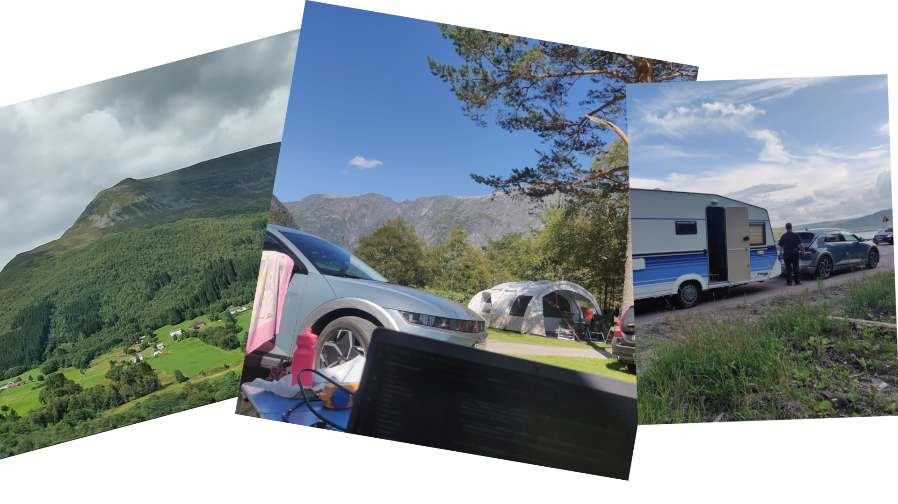

## What is a "talent" program?
A talent program is marketing jumbo for a trainee program or track. It's popular in the IT field as a recruitment path for students and fresh graduates. The quality and activities of these programs vary by company and culture. However, in Finland, I've mostly heard positive things about the trainee tracks offered by larger companies. And my own experience definitely falls into that bucket as well.

Wapice Talents is, surprise surprise, Wapice's own take on the traditional trainee program. It offers participants the opportunity to contribute to real customer projects while receiving dedicated mentorship and targeted training tailored to the needs of the Talents group. For example, we got an additional Git workshop and a peptalk for a company wide Hackathon, among other things. Keep reading to learn about my personal experience, but also take peek at the official material here: https://wapice.com/careers/wapice-talents/

## The beginning
I applied to the program because my university friends recommended it, and one of them was participating at the time. Wapice usually accepts around 8 people into the Talents program, and the number of applicants has exceeded 500 the past few times. So it's fair to say I wasn't exactly confident being a 2nd year Bachelor's student.

But as luck would have it with a sprinkle of hard work, I got an interview! And to keep the next part short, I did really well in all the stages and they happened to need someone with fullstack and Unity experience. So I was an excellent candidate for the project I would later be starting.

My first day started at the Tampere office, where I got to meet all my fellow Talents, mentors and pick up most of my gear. The day was filled with essential onboarding for our projects, but also included plenty of time to hang out and get to know each other.

## The project
It took around a month for my project to actually start. So I spend time refreshing my Unity knowledge and doing the CodeMonkey course I have on my [recommended list](/links). Getting paid to study feels pretty amazing, but starting the proper project was even better. My task was to create a new visual guided selling tool that could be integrated to an existing Wapice product.

This project took up most of my time at Wapice and was developed in close collaboration with the customer. That meant A LOT of meetings and figuring out what exactly the customer wanted. And naturally, how to spin it into existence with the black magic we call code. So, a lot of valuable insight and experience gained there.

What surprised me the most was how often things would flip around on a week by week basis. Last weeks most-wanted feature could easily become this week's top priority fix, now needing to function in a completely different way. But you learn from that too. I'd argue my ability to write modular code as a foundation for new features got a massive boost. The process evolved from "How do I build this ASAP?" to "How do I build this in a way that's easy to tweak later on?" — and that was a really cool thing to notice.

On the development side, integrating the Unity Web build with the existing infastructure was pretty straight forward. I built a basic REST API and we standardized the JSON communication between Unity and the Selector product. This way the Unity tool could be navigated and updated throught Selectors code directly.

## Working & studying
These trainee programs are usually aimed at students, so companies are more flexible with the working hours. They want you to graduate after all! I worked 1-3 days a week the whole time. Having the option to do a more university focused week is necessary if you want to do some cramming before exams. Or if, like me, you happen to do tutoring and guild volunteering. This is also where being able to work remotely saves the day during busy weeks.

In the end, it's a balancing act. You really have to figure out what works for you and how to juggle your time and energy effectively. While I'm still learning a lot in that department, I found it pretty manageable with the 1-3 days per week setup.

## Traveling
Working remotely also has other benefits — you only need an internet connection to do your job! So, I took a 3-week road trip to Norway with half of my family.

At Wapice I was allowed to travel to other EU countries up to a month at a time, as long as my project allowed it. Projects done for the Finnish government are often the most regulated, but otherwise, you should be able to travel no problems!

I attended meetings and wrote code, just with a much prettier view. And this is a big reason why I _love_ the IT field!

Making a tiny vlog about this trip is still on my todo list... Well maybe this summer. Plenty of video material to edit.

## What did I learn?
A lot! On top of managing a bigger project, customer communication and how to operate within a larger company. I learned a lot about good coding habits, code structure and especially modularity. I also (surprisingly) learned that work doesn't have to be just work all the time. The company wide Hackathon was such a cool experience and the "Summium Days" event was great as well! Free food, sauna, work buddies and brainstorming. What more can you ask for?!

I spent a good portion of my employment working remotely. But I still had plenty of opportunities, both online and in person, to network and meet people through different channels. The athmosphere and vibes at the office were always chill and people were super willing to help. And I can't forget the office breakfast on Wednesdays!

## Now what?
Although my journey at Wapice ended a little sooner than I had hoped, I can wholeheartedly recommend the Talents track to all students. Decent pay, actual projects, flexible hours and freedom to travel are quite neat perks to have. And that's on top of the usual ePassi benefits and a genuinely nice work environment.

For me this means I get to spend more time finishing my Batchelor's thesis and I'll be on the lookout for new opportunities to challenge myself. With the IT field being in a bit of a frenzy, I might just have to start my summer vacation a little early. Then again... That doesn't sound that bad, does it?

If you have any questions about the Talents program or my experience, feel free to reach out to me on [LinkedIn](/about#social-networks)!